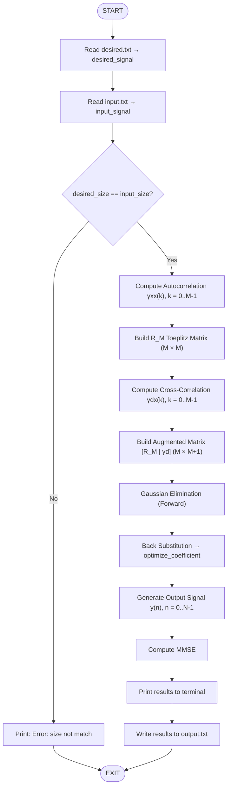
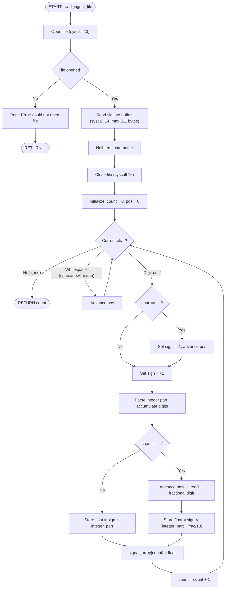
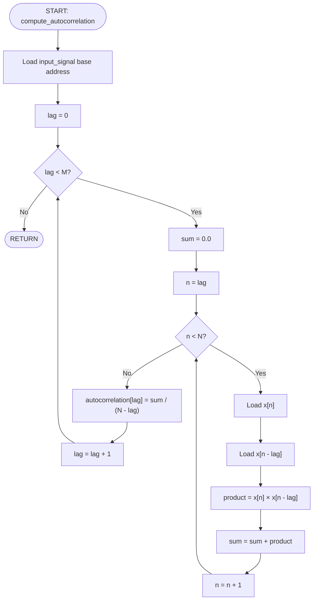
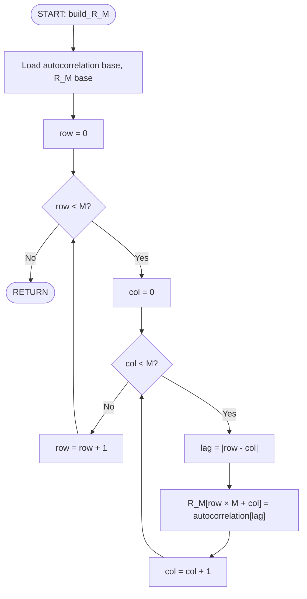
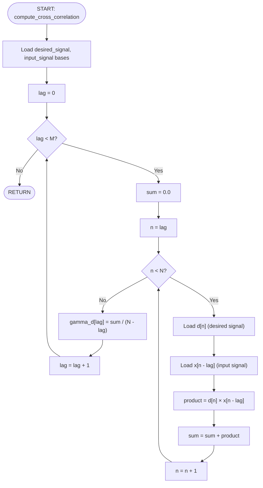
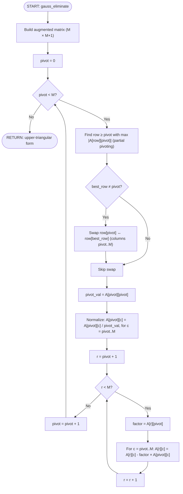
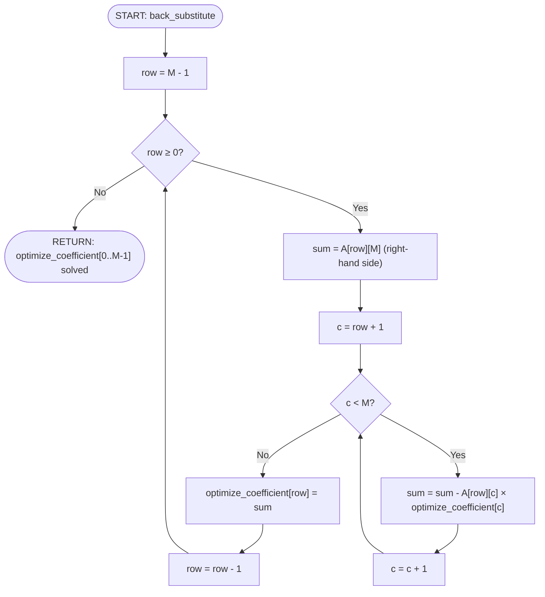
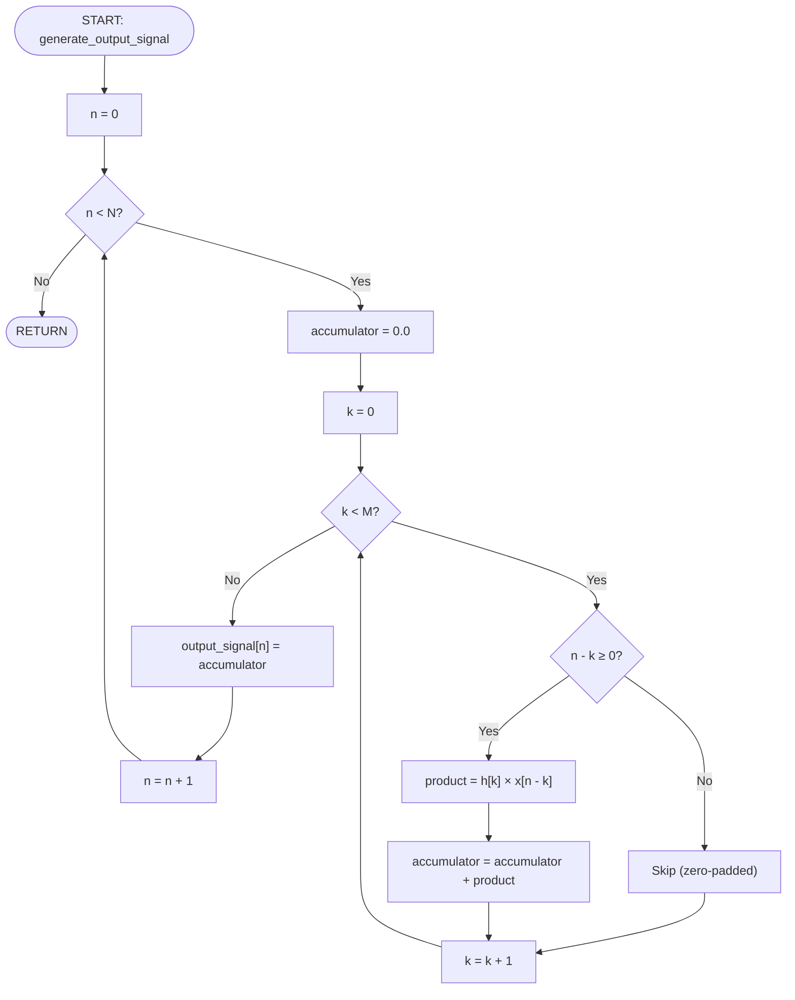
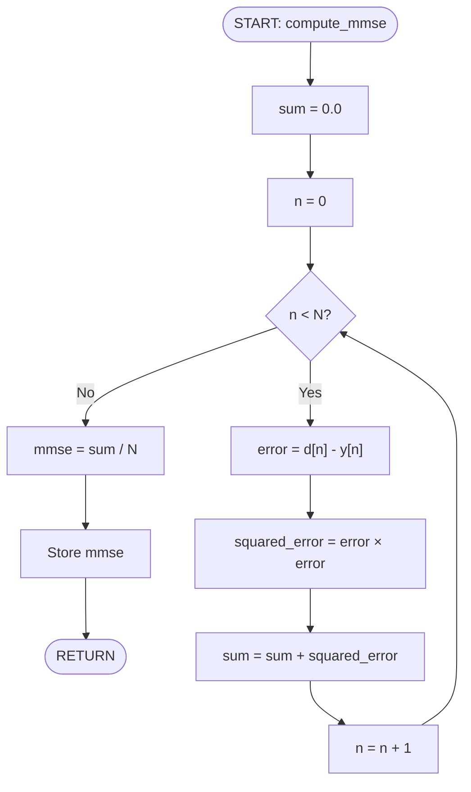
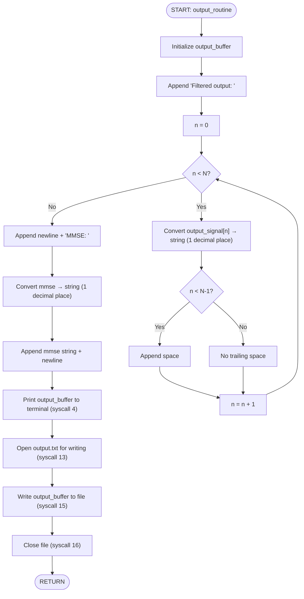

# Wiener Filter — Algorithm Flowcharts
**Course:** Computer Architecture Lab (CO2008)  
**Assignment:** Filtering and Prediction Signal with Wiener Filter  
**Role:** Member 1 — Math, Algorithm Design & System Architect  

---

# 1. Main Program Flow

---

# 2. File Reading & Parsing Flow

---

# 3. Autocorrelation Flow

$$\gamma_{xx}(k) = \frac{1}{N-k} \sum_{n=k}^{N-1} x(n) \cdot x(n-k), \quad k = 0, 1, \ldots, M-1$$

---

# 4. R_M Toeplitz Matrix Construction Flow

$$R_M[i][j] = \gamma_{xx}(|i - j|)$$

---

# 5. Cross-Correlation Flow

$$\gamma_{dx}(k) = \frac{1}{N-k} \sum_{n=k}^{N-1} d(n) \cdot x(n-k), \quad k = 0, 1, \ldots, M-1$$

---

# 6. Gaussian Elimination Flow (Forward Elimination)

Solves $R_M \mathbf{h} = \boldsymbol{\gamma}_d$ via augmented matrix $[R_M | \boldsymbol{\gamma}_d]$

---

# 7. Back Substitution Flow

---

# 8. Output Signal Generation Flow

$$y(n) = \sum_{k=0}^{M-1} h_k \cdot x(n-k), \quad x(n-k) = 0 \text{ if } n-k < 0$$

---

# 9. MMSE Calculation Flow

$$\text{MMSE} = \frac{1}{N} \sum_{n=0}^{N-1} \big(d(n) - y(n)\big)^2$$

---

# 10. Output Formatting & File Writing Flow

---

# 11. Parameters Used

| Parameter | Value | Description |
|-----------|-------|-------------|
| M | 10 | Filter length (= signal length N) |
| N | 10 | Number of signal samples |
| R_M dimensions | 10 × 10 | Toeplitz autocorrelation matrix |
| Augmented matrix | 10 × 11 | [R_M \| γd] for Gaussian elimination |
| optimize_coefficient | 10 × 1 | Wiener filter coefficients h(0..9) |

---

*This document provides visual flowcharts for every algorithmic component of the Wiener filter MIPS implementation, suitable for inclusion in the final assignment report.*
